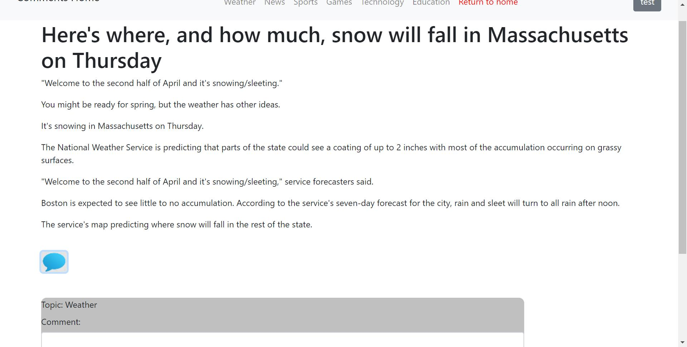
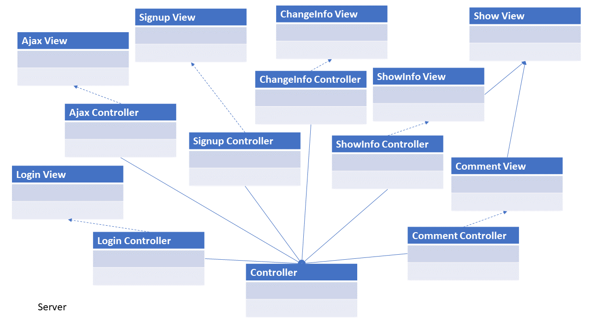
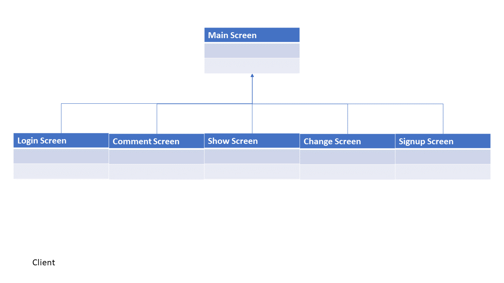
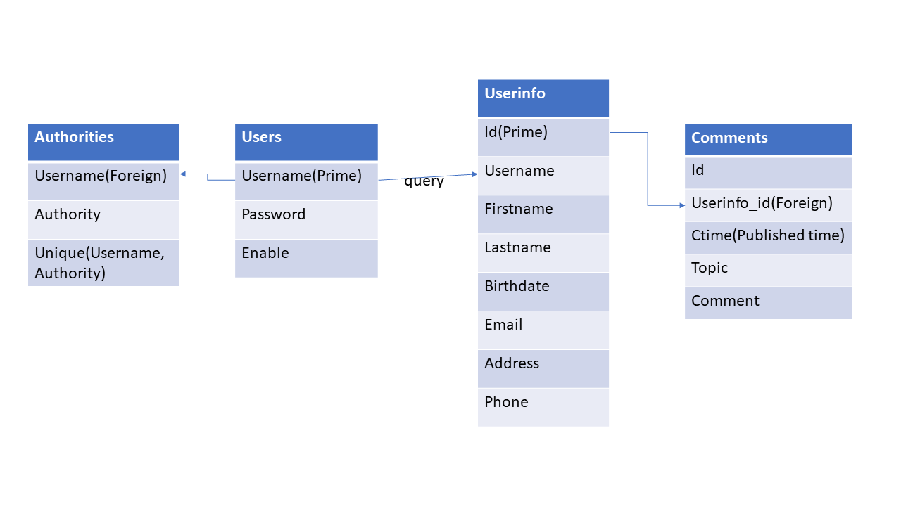

# News Comment
## [Web Demo](http://13.59.117.92:8080/regist)
 
## Introduction
### Overview
This software aims to provide an application for people to save some personal information. And also, there are some topics of news on the application that let the user to add some comments on the topics. On the other hand, the supervisor can manage the comments, such as delete the comments that are not suitable.
### Functions
The users need to sign up for a new account to log in the software. As a normal user, one only needs his username and password to get the account. But for the supervisor, there is also a unique verify number needed to verify the user can be a supervisor. After signing up, the user can use the new account to log in to his user home page. He can add his personal information on the manage information page. He can also see his personal information. If he wants to add some comments on the topic he likes, he can do that. And these functions can also be used by supervisor. But the supervisor has more rights on the comment, which let him delete the comment.
## Low-level Design
### Server
 
### Client
 
## Database Logic
 
## Interfaces
* Java Standard Edition Development Kit or Java Standard Edition Runtime Environment 8(Version 1.8)
* Spring Source dm Server v3.2.8
* Spring Tool Suite v3.9.2
* Spring Framework v5.0.5
* Spring Security v5.0.4
* Spring orm v5.0.5
* Spring aop v5.0.5
* Hibernate v5.2.16
* Bootstrap v4.1.0
* jQuery and Ajax v3.3.1
